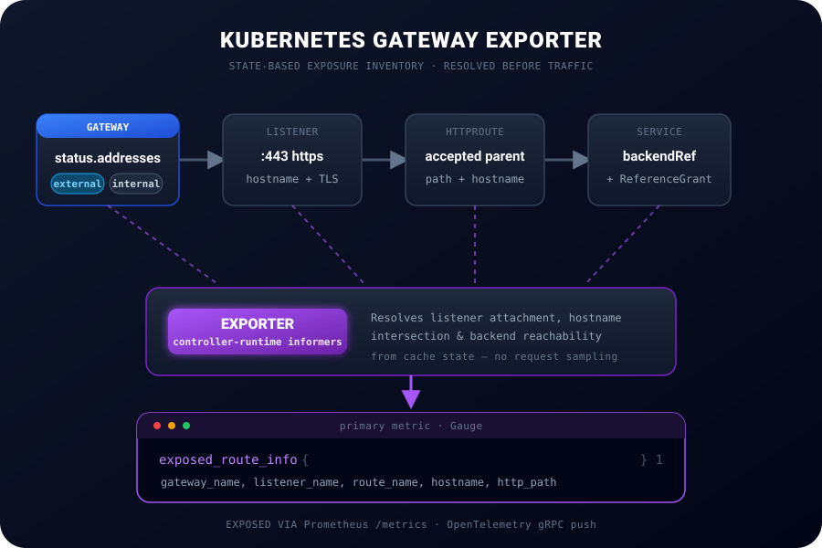

<div align="center">
  
  <h1>Kubernetes Gateway Exporter</h1>
  <p><strong>Observability exporter for the Kubernetes Gateway API</strong></p>

  [](https://go.dev/)
  [](https://opensource.org/licenses/Apache-2.0)
  [](https://gateway-api.sigs.k8s.io/)
  [](https://github.com/tokanize/kubernetes-gateway-exporter/actions/workflows/ci.yml)
  [](https://github.com/tokanize/kubernetes-gateway-exporter/actions/workflows/codeql.yml)
  [](https://github.com/tokanize/kubernetes-gateway-exporter/actions/workflows/govulncheck.yml)
  [](https://tokanize.github.io/kubernetes-gateway-exporter/)
  [](https://deepwiki.com/tokanize/kubernetes-gateway-exporter)
</div>

---

## Overview

Gateway API exposure-inventory exporter for Kubernetes — maps Gateway→Listener→HTTPRoute→Service into the `exposed_route_info` Prometheus/OTel metric.

**Automatically discover and monitor all your externally exposed Kubernetes services. Gain visibility into your external attack surface by tracking every exposed endpoint and service via Gateway API.**

<div align="center">
  
</div>

## Features

- **Controller-Runtime Informers:** Uses the native K8s cache instead of polling the API server.
- **Semantic Resolution:** Evaluates accepted Route parents, listener attachment rules, hostname intersections, ReferenceGrants, and Service backends.
- **Multi-Protocol:** Prometheus `/metrics` endpoint and OpenTelemetry gRPC push support.
- **Hardened Runtime:** Distroless image, non-root execution, read-only filesystem, HTTP timeouts, and read-only RBAC.
- **Provider Independent:** Reads addresses from the standard `Gateway.status.addresses` field without cloud-provider APIs.
- **Spec-Driven:** Documentation and requirements managed via [OpenSpec](./openspec/specs/).

---

## Quick Start

### Build and Test
```bash
make fmt
make test
make build
./bin/exporter
```

### Deploy

From the published OCI chart (signed, see [verification](./docs/verification.md)):
```bash
VERSION=0.1.2 # Replace with the release you want to install

helm upgrade --install gateway-exporter \
  oci://ghcr.io/tokanize/charts/kubernetes-gateway-exporter --version "${VERSION}" \
  --namespace monitoring --create-namespace
```

Or from local source:
```bash
helm upgrade --install gateway-exporter ./deploy/chart/kubernetes-gateway-exporter \
  --namespace monitoring \
  --create-namespace
```

---

## Metrics

The primary metric is `exposed_route_info` (Gauge), which explicitly identifies exactly which route, listener, and hostname produced an exposure relationship.

It describes logical Gateway API routing relationships, not Pod IPs or `EndpointSlice` members. A Service with five backing Pods still produces one series for each valid listener/hostname/path/backend combination, not five Pod-level series.

It includes the following labels:
- `namespace`: HTTPRoute namespace, retained for resource identity and backward compatibility.
- `gateway_name`: Parent Gateway name.
- `route_name`: `metadata.name` of the HTTPRoute.
- `hostname`: Effective intersection hostname.
- `listener_name`: Gateway listener attached.
- `http_path`: Route path match.
- `service_name`: Backend Service name.
- `backend_namespace`: Backend namespace.
- `backend_port`: Target backend port.
- `lb_type`: `internal` or `external`, heuristically inferred from the GatewayClass name.
- `ip_address`: First IP from `Gateway.status.addresses`, or an empty string while unavailable.

Users can locate the source YAML producing a specific metric series by running
(substitute the `namespace` and `route_name` label values):
```bash
ROUTE_NAMESPACE=default
ROUTE_NAME=my-route
kubectl get httproute -n "$ROUTE_NAMESPACE" "$ROUTE_NAME" -o yaml
```

---

## Supply chain security

Each release publishes multi-arch container images to
`ghcr.io/tokanize/kubernetes-gateway-exporter`, signed by digest with cosign
keyless signing (GitHub OIDC — no long-lived keys). Every release also includes
GitHub Artifact Attestations (build provenance) for the image, chart, binary
archives, and SBOMs. SPDX SBOMs (`sbom-image.spdx.json`,
`sbom-source.spdx.json`) and binary archives are covered by a signed
`checksums.txt` in releases produced by the hardened workflow.

**Quick image signature check:**

```bash
VERSION=0.1.2 # Replace with the release you want to verify
SOURCE_REF="refs/tags/v${VERSION}"

# 1. Resolve an immutable digest for the tag
IMAGE=ghcr.io/tokanize/kubernetes-gateway-exporter
DIGEST=$(docker buildx imagetools inspect "${IMAGE}:${VERSION}" \
  --format '{{json .}}' | jq -r '.manifest.digest')

# 2. Verify the cosign signature
cosign verify \
  --certificate-identity "https://github.com/tokanize/kubernetes-gateway-exporter/.github/workflows/release.yml@${SOURCE_REF}" \
  --certificate-oidc-issuer "https://token.actions.githubusercontent.com" \
  "${IMAGE}@${DIGEST}"
```

These checks establish artifact provenance and integrity; they do not guarantee
the software is free of vulnerabilities or that your environment is
policy-compliant.

For complete copy-pasteable verification steps (image, binary, checksums,
SBOMs) see [docs/verification.md](./docs/verification.md). For the CI scanning
layer (static analysis, container scanning, dependency auditing) see
[docs/security-scanning.md](./docs/security-scanning.md). To report a
vulnerability see [SECURITY.md](./SECURITY.md).

---

## Documentation Directory

Welcome to the central entrypoint for the Kubernetes Gateway Exporter documentation. All project rules, architectural decisions, and API schemas are maintained across the following sections:

> [!TIP]
> **Interactive Code Wiki:** For a comprehensive, structure-mapped walkthrough of these documents and the underlying codebase, check out the **[DeepWiki Documentation](https://deepwiki.com/tokanize/kubernetes-gateway-exporter)**.

### 1. General & Architecture
- **[Architecture & Overview](./docs/architecture.md)**: Conceptual model mapping Gateway -> Listener -> HTTPRoute -> Service.
- **[Architecture Decision Records (ADRs)](./docs/adrs/)**: Technical design choices and rationales.


### 2. APIs & Requirements
- **[OpenAPI Schema](./docs/api/openapi.yaml)**: Strict structural definition of the metrics API endpoint.
- **[OpenSpec Requirements](./openspec/specs/)**: Functional requirements driven by BDD scenarios (GIVEN/WHEN/THEN) validating metrics, informers, probes, and IP resolution.

### 3. Agent Instructions
We employ multi-agent LLM systems to maintain this repository. Agent personas and operational mandates:
- **[Agent Routing Hub](./AGENTS.md)**: Main hub for automated assistants.
- **[Gemini Constraints](./GEMINI.md)**
- **[Codex Constraints](./CODEX.md)**
- **[Claude Constraints](./CLAUDE.md)**

### 4. Security & Releases
- **[Security Scanning (CI)](./docs/security-scanning.md)**: Static analysis, container scanning, and dependency auditing in CI.
- **[Release Verification](./docs/verification.md)**: Step-by-step guide for verifying image signatures, build provenance, checksums, and SBOMs.
- **[Security Policy](./SECURITY.md)**: Vulnerability reporting process and supported versions.
- **[Contributing](./CONTRIBUTING.md)**: Development workflow, code conventions, and pull request process.

### 5. Guides
- **[Testing Locally on kind](./docs/testing-on-kind.md)**: E2E local verification guide mocking Gateway API controller behavior.

### 6. Code Intelligence
The repository ships two complementary code-navigation aids that the multi-agent assistants prefer over raw `grep`/`find`:
- **CodeGraph MCP**: When the CodeGraph MCP server is available, agents query it (`codegraph_explore`) for live, on-demand structural lookups. Its index cache (`.codegraph/`) is local-only and never committed.
- **[graphify knowledge graph](https://github.com/safishamsi/graphify)**: A committed, queryable knowledge graph of the codebase under [`graphify-out/`](./graphify-out/) (`graph.json`, interactive `graph.html`, `GRAPH_REPORT.md`). Run `graphify query "<question>"`, `graphify path "<A>" "<B>"`, or `graphify explain "<concept>"` for a scoped subgraph; rebuild after code changes with `graphify update .` (AST-only, no API cost). See [ADR-007](./docs/adrs/007-knowledge-graph.md) for the rationale and [CONTRIBUTING.md](./CONTRIBUTING.md) for local setup.

<div align="center">
  <i>Built by <a href="https://github.com/tokanize">@tokanize</a> to scratch a personal observability itch. Over-engineered? Maybe. Useful? Absolutely.</i>
</div>
